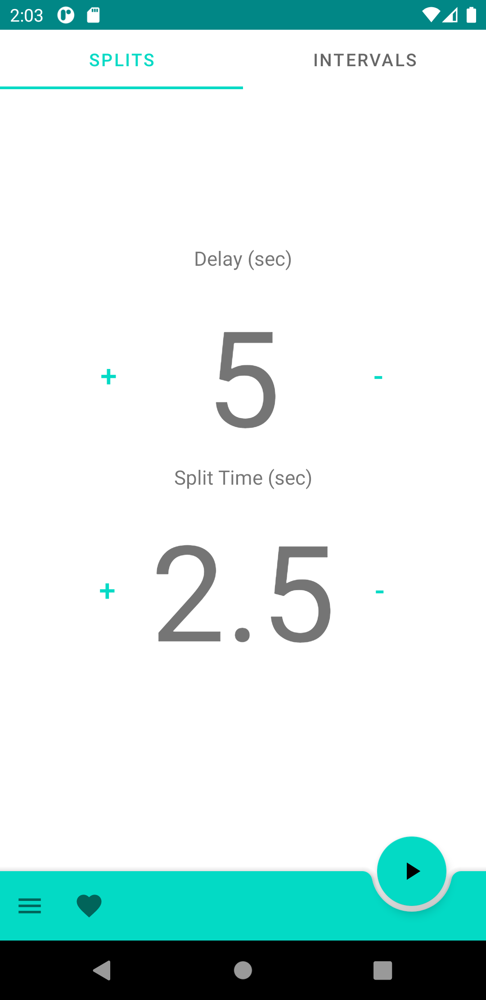

# Splits!
> Training timer for passionate shooters

You can find it on Google Play [_here_](https://play.google.com/store/apps/details?id=com.patoka.splits).

## Table of Contents
* [General Info](#general-information)
* [Technologies Used](#technologies-used)
* [Screenshots](#screenshots)
* [Project Status](#project-status)
* [Contact](#contact)

## General Information
Project was born from passion and quickly evolved into a production ready app for training purposes. Splits will help you train more efficently on range and at home.

## Technologies Used
- Kotlin (Coroutines, yay!)
- Android SDK
- Android Jetpack Library (ROOM, ViewModel, LiveData, Animations etc.)
- Material UI
- Built using MVVM Pattern
- JUnit with Truth for testing purposes

## Screenshots

## Project Status
Project is: _in progress_ (source code is always step ahead of what you'll see on Play store, I use this repo for implementing new technologies as I learn them).

## Contact
Created by [@maciejdzienis](https://www.patoka.io/) - feel free to contact me!
